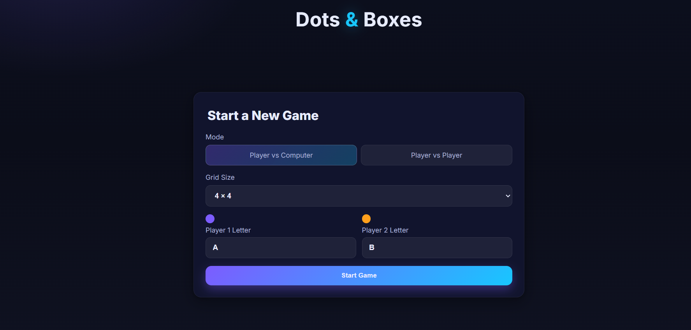
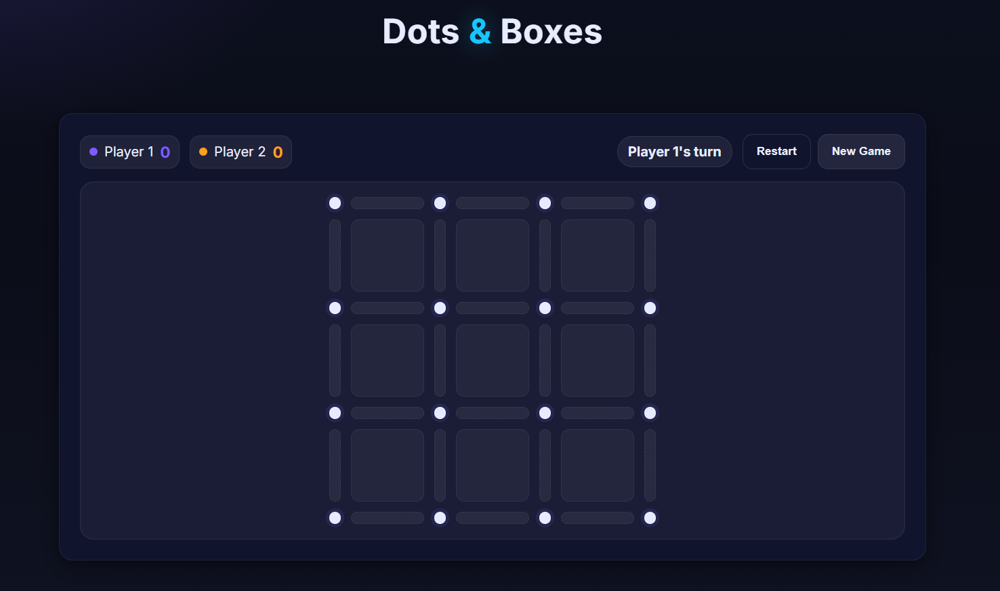

# Dots & Boxes (Vanilla JS)

A modern, responsive implementation of the classic Dots and Boxes game using semantic HTML, modern CSS (Grid/Flexbox), and vanilla JavaScript.

## 🖼️ Preview
 
 


## Features
- Player vs Computer and Player vs Player modes
- Grid sizes: 4×4, 5×5, 6×6, 7×7 (dots per side)
- Custom player letters inside claimed boxes
- Extra turn when a box is completed
- Live scoreboard and current turn indicator
- Hover highlights and smooth transitions
- Basic AI with a simple box-avoidance heuristic
- Fully responsive for desktop, tablet, and mobile

## Run Locally
- Open `index.html` in any modern browser (Chrome, Edge, Firefox, Safari). No build step required.
- Optional local server:
  - VS Code Live Server
  - Python: `python -m http.server`
  - Node: `npx serve`

## How to Play
1. Choose the mode and grid size on the setup screen.
2. Enter the display letter for each player.
3. Click an available edge between two dots to draw a line.
4. Completing the fourth edge of a box claims it and grants another turn.
5. When all boxes are claimed, the higher score wins.

## Project Structure
```
.
├─ index.html   # Structure: setup screen + game UI
├─ style.css    # Styles: modern theme, responsive grid/flex, animations
└─ script.js    # Logic: board generation, turns, scoring, simple AI
```

## Customize
- Colors and sizing via CSS variables in `style.css` (`:root`): `--p0`, `--p1`, `--accent`, `--box-size`, `--dot-size`, `--edge-thick`.
- AI behavior in `computeAIMove()` inside `script.js`.
- Player labels and text in `index.html` / `script.js`.

## Accessibility
- Clear focus and hover states, high-contrast theme, ARIA roles on the board.

## License
MIT
